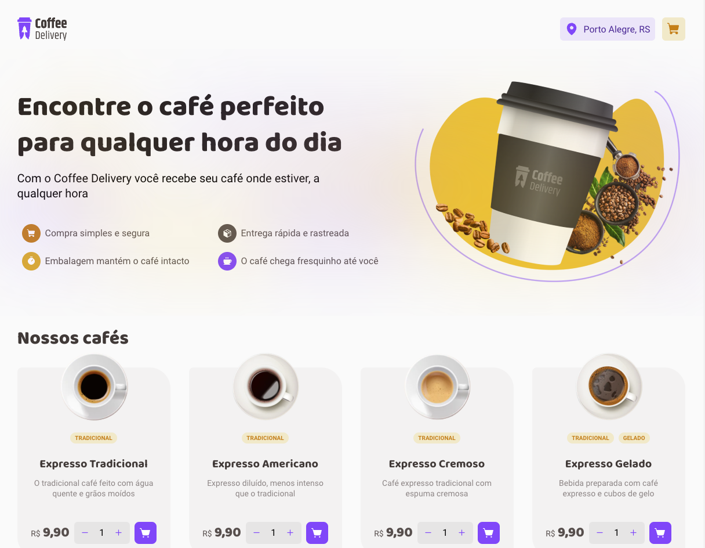
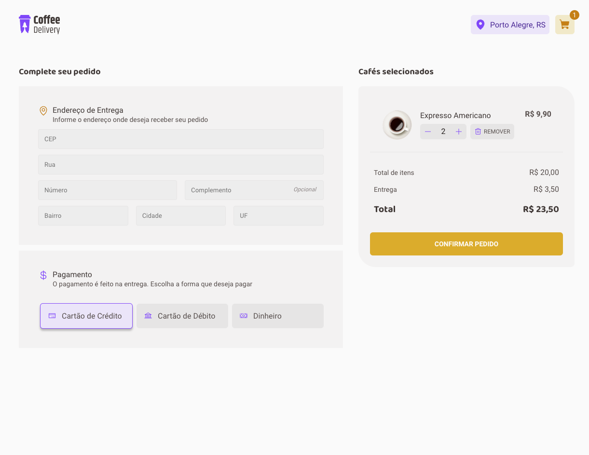
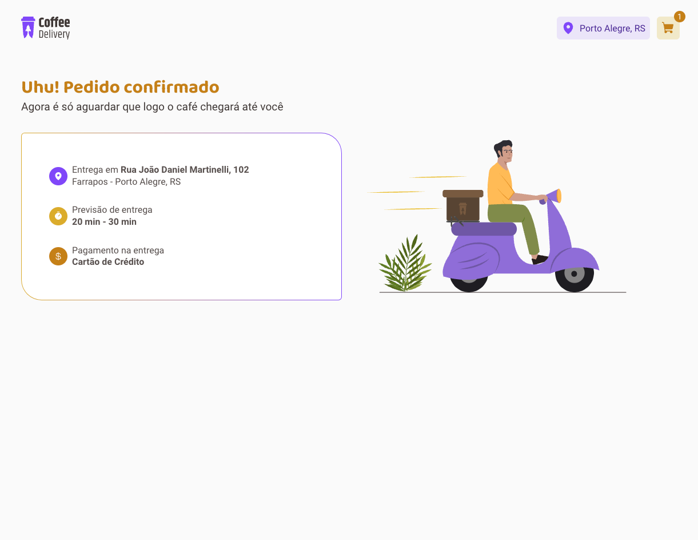

<div align="center">
    
<h1 align="center">Coffee Delivery</h1>
</div>

## Projeto

Este projeto trata-se de um desafio do bootcamp Ignite, a aplicação simula uma espécie de e-commerce de vendas de cafés com diversas opções a escolha.

## Preview

<p align="left">
  
  
</p>
<p align="left">
  
</p>

## Demonstração
Acesse no endereço:
https://inspiring-alfajores-0ec25b.netlify.app


## Layout
Você pode visualizar o layout do projeto através do link abaixo:

- [Layout Web](<https://www.figma.com/file/qGJgHlYAEU4A5xk7gvsBc9/Coffee-Delivery-%E2%80%A2-Desafio-React-(Copy)?type=design&node-id=2-12&t=tnflOyfAMmgaXcuz-0>)

## Tecnologias

Tecnologias utilizadas no projeto:
- [React](https://reactjs.org)
- [Vite](https://vitejs.dev/)
- [Typescript](https://www.typescriptlang.org/)
- [Phosphor Icons](https://phosphoricons.com/)
- [React Hot Toast](https://react-hot-toast.com)
- [Styled Components](https://styled-components.com)
- [Netlify](https://www.netlify.com/)

## Como utilizar
Essa aplicação utiliza [Nodejs](https://nodejs.org/en/) para a execução do mesmo.

Baixe o repositório clicando no botão "Clone" e depois "Download ZIP".

Você também pode utilizar o [Git](https://git-scm.com/) para clonar o repositório

```bash
git clone https://github.com/emersonmelomartins/coffee-delivery.git
```

### Instalação via node ou yarn
```bash
# yarn
yarn
# node
npm install
```

### Execução do projeto
```bash
# yarn
yarn dev
# node
npm run dev
```
